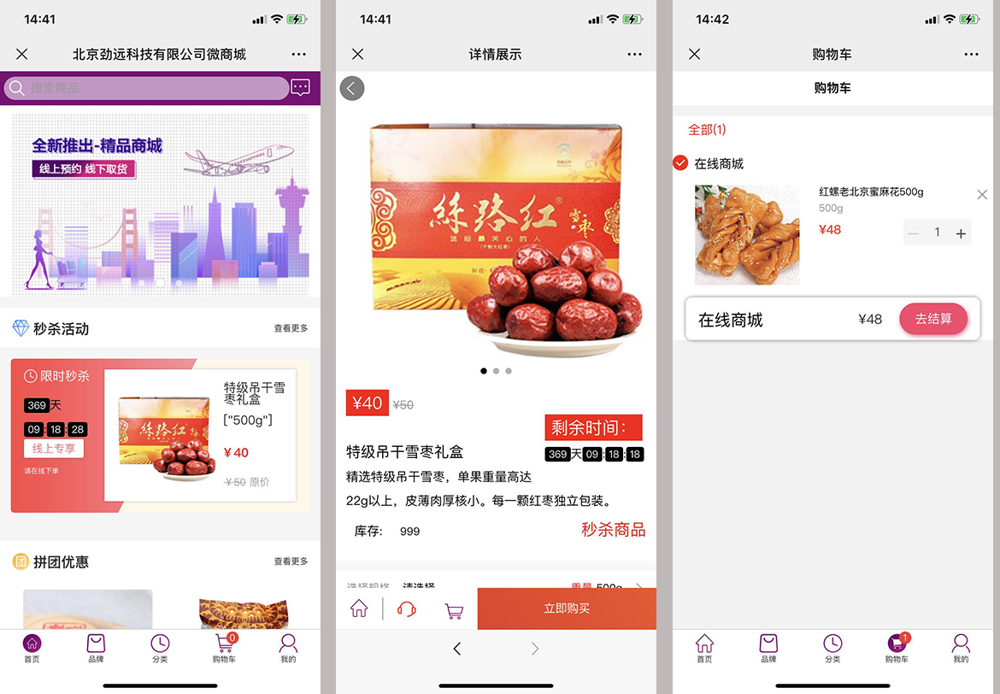
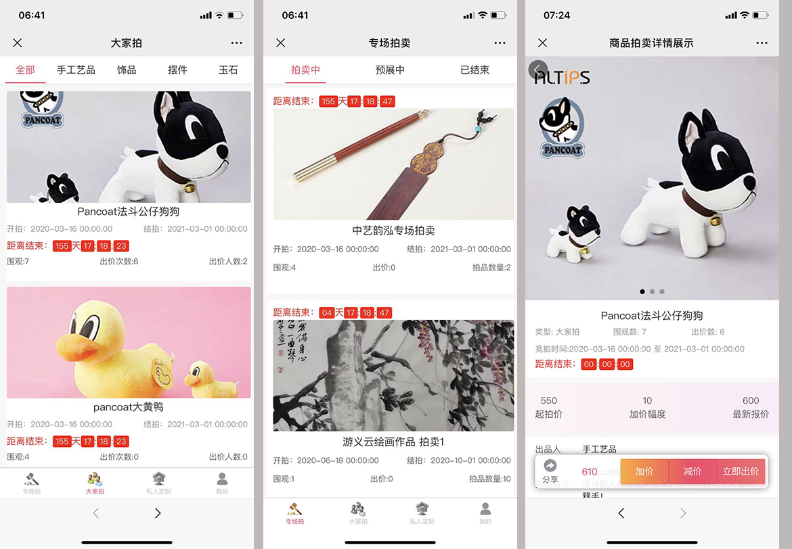
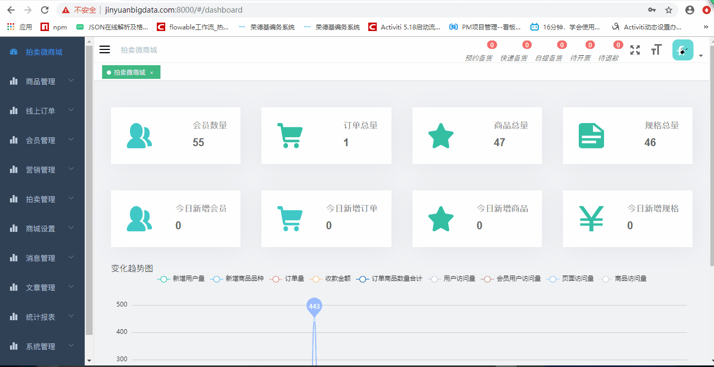
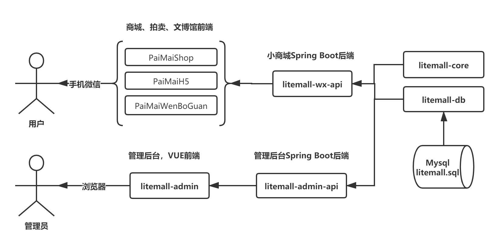
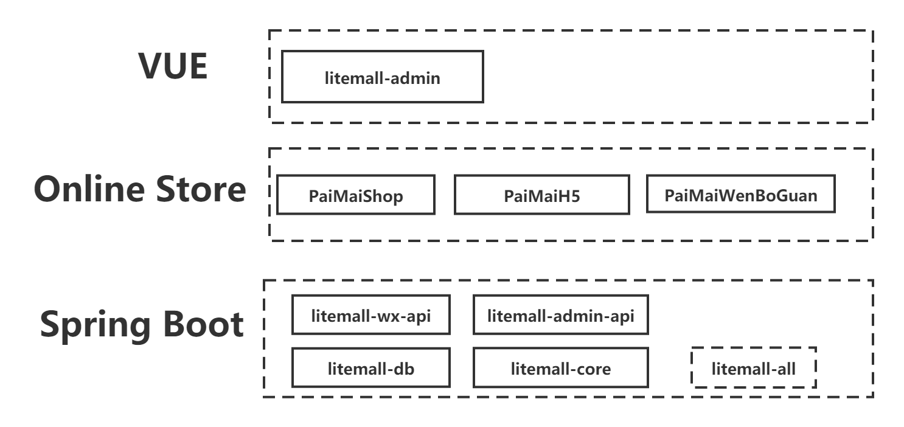

# 劲远科技电商拍卖系统
本系统商城端用Uniapp开发，后端UI部分基于VUE+Element，业务后台采用Java。电商部分非常成熟，
经受了1小时内4000单以上的实战考验。拍卖部分是根据某用户的需求进行定制开发。还有文博馆部分，通过分享机制，实现内容带货，
可以在文章里嵌入商城和拍卖链接,起到导流的作用,该部分由于属于非商城部分，暂不部署，如果有需要请私下联系我。
  积分商城和积分权益暂无，B2B2C暂不支持，分销(CPS)暂不支持，如果需要可以在此基础上再延展开发，
  开源不易，如果此项目能够帮到您，欢迎您的捐赠，如果您有特殊的需求，我们也愿意提供有偿的定制化开发服务。
  项目功能齐全，体系完善，后台在借鉴litemall商城基础上，前后台增加了团购、秒杀、会员、品项折扣等营销活动，
  增加了预约单(已实现，前后端默认隐藏)、单据导出PDF打印、虚拟商品销售、下单开票等功能
 
ePaiShop = Spring Boot后端 + Vue管理员前端 + 电商微商城 + 拍卖微商城 + 文博馆

* [文档](https://jinyuanjava.gitbook.io/ePaiShop)
* [贡献](https://jinyuanjava.gitbook.io/ePaiShop/contribute)
* [FAQ](https://jinyuanjava.gitbook.io/ePaiShop/faq)

## 项目实例

### 微信商场实例

* 在线商城测试实例(请勿在此商城支付)

*    
> 注意：此商城是测试商城，请不要尝试购买商品、付款、退款操作。

 


* 在线商城真实实例(首都机场商贸微商城)

*    
> 注意：此商城是真实商城，可以正常的下单预约购买。

* 拍卖商城

    
> 注意：此实例是测试拍卖微商城，请不要尝试购买商品、付款、退款操作。



 
### 管理后台实例

    

### 服务器演示网址
1. 浏览器打开，输入以下网址: [http://www.jinyuanbigdata.com:8000](http://www.jinyuanbigdata.com:8000)
2. 管理员用户名`admin123`，管理员密码`admin123`
3. 由于开放了全部功能，不排除有人恶意修改用户名和密码功能,系统可能会不定期的清空和复位，请您正常合理使用。
 
## 项目代码

* [码云](https://gitee.com/zxtbaty/online-store-and-paimai.git)
* [GitHub](https://github.com/zxtbaty/OnlineStoreAndPaimai.git)

## 项目架构
    

## 技术栈

> 1. Spring Boot
> 2. Vue
> 3. 微商城

    

## 功能

### 在线商城功能

* 首页
* 会员专享
* 秒杀
* 团购
* 品项折扣
* 活动列表
* 品牌列表、品牌详情
* 分类列表、分类详情
* 搜索
* 商品详情、商品评价、商品分享
* 购物车
* 下单
* 自提货点,可以由用户自提
* 预约(隐藏未见)
* 订单列表、订单详情
* 地址、足迹、帮助中心
* 优惠券、积分（此处对接CRM系统，如果是线上领券和积分需要定制）
* 客服

### 拍卖

* 专场拍列表(拍卖中、预展中、已结束)
* 专厂拍详情(拍品列表)
* 大家拍详情
* 拍卖保证金、出价记录
* 订单管理
* 私人定制，预定，规则，保证金
* 搜索
* 拍品详情、拍品分享
* 下单
* 订单列表、订单详情
* 地址、足迹、帮助中心
* 保证金、出价记录
* 客服
### 管理平台功能

* 商品管理
* 线上订单
* 会员管理
* 营销管理
* 拍卖管理
* 商城设置
* 消息管理
* 文章管理
* 统计报表
* 系统管理
* 运维管理


## 快速启动

1. 配置最小开发环境：
    * [MySQL](https://dev.mysql.com/downloads/mysql/)
    * [JDK1.8或以上](http://www.oracle.com/technetwork/java/javase/overview/index.html)
    * [Maven](https://maven.apache.org/download.cgi)
    * [Nodejs](https://nodejs.org/en/download/)
    * [UniApp/Hbuilder](https://www.dcloud.io)
    * [微信开发者工具](https://developers.weixin.qq.com/miniprogram/dev/devtools/download.html)
    
2. 数据库依次导入litemall-db/sql下的数据库文件
    * litemall_schema.sql
    * litemall_table.sql
    * litemall_data.sql
    
    打包
        ```
        cd litemall
        cat ./litemall-db/sql/litemall_schema.sql > ./deploy/db/litemall.sql
        cat ./litemall-db/sql/litemall_table.sql >> ./deploy/db/litemall.sql
        cat ./litemall-db/sql/litemall_data.sql >> ./deploy/db/litemall.sql
        
        cd ./litemall-admin
        cnpm install
        cnpm run build:dep
        
        cd ..
        mvn clean package
        cp -f ./litemall-all/target/litemall-all-*-exec.jar ./deploy/litemall/litemall.jar
        ```
        如果是在Windows下，可以直接用命令方式启动：
        java -jar litemall.jar 
        
        //如果在Linux下，用以下命令方式启动
        nohup java -jar litemall.jar &  //--servercd.port=8090 
        

3. 启动微商城、拍卖和文博馆后台的后端服务

    打开命令行，输入以下命令
    ```bash
    cd litemall
    mvn install
    mvn package
    cd ./litemall-all
    mvn spring-boot:run
    ```
    
    
    
4. 启动管理后台前端

    打开命令行，输入以下命令
    ```bash
    npm install -g cnpm --registry=https://registry.npm.taobao.org
    cd litemall/litemall-admin
    cnpm install
    cnpm run dev
    ```
    此时，浏览器打开，输入网址`http://localhost:9527`, 此时进入管理后台登录页面。
    
5. 启动在线商城前端
   安装HBuilder,在HBuilder开发工具中打开,PaiMaiShop,配置API接口地址，打开，编译运行即可。关于
   HBuilder开发Uniapp请参见官方文档。
  
6. 启动拍卖前端

   安装HBuilder,在HBuilder开发工具中打开,PaiMaiH5,配置API接口地址，打开，编译运行即可。关于
   HBuilder开发Uniapp请参见官方文档。
                                                                                                      >
6. 启动文博馆前端

   安装HBuilder,在HBuilder开发工具中打开,PaiMaiWenBoGuan,配置API接口地址，打开，编译运行即可。关于
   HBuilder开发Uniapp请参见官方文档。
       
## 开发路线图

当前版本[v1.0.0](https://jinyuanjava.gitbook.io/litemall/changelog)

目前项目开发中，存在诸多不足，以下是目前规划的开发计划。

V 1.0.0 完成以下目标：

1. 通用的简单微商城和小程序能够实现正常的购物结算流程；
2. 团购、秒杀、会员、品项折扣等促销规则能够正常使用；
3. 拍卖和定制能够创建订单，完成支付下单功能。
4. 文博馆可以实现内容的维护、分享、链接、导流功能

V 2.0.0 完成以下目标：

1. 拍卖细节的完善，如保证金的退还规则等；
2. 优惠券的前台发放和领用；
3. 如果没有CRM系统，积分兑换规则、权益及积分商城；
4. 分销功能(CPS)；
 
V 3.0.0 完成以下目标：

1. 缓存功能以及优化一些性能
2. B2B2C，增加商家客户端，业务提交、审批、订单、营销、结算等功能
3. 商家店面自定义装修

## 警告

> 1. 本项目可用于学习、商业、自由演绎，不受任务限制
> 2. 本项目部分功能和模块还不完善，仍处在开发中，不承担任何使用后果
> 3. 本项目代码开源[MIT](./LICENSE)，项目文档采用 [署名-禁止演绎 4.0 国际协议许可](https://creativecommons.org/licenses/by-nd/4.0/deed.zh)

## 致谢

本项目基于或参考以下项目：

1. [litemall](https://github.com/linlinjava/litemall)

   项目介绍：又一个小商城。litemall = Spring Boot后端 + Vue管理员前端 + 微信小程序用户前端 + Vue用户移动端

   项目参考：
   
   1. 后台的主要架构均参照该项目；
   2. 该项目参照的基它项目在其说明中已经明确列出，因为是间接参照，此处不再列出。

## 交流
喜欢别忘了 Star，有问题可通过微信、公众号、QQ 群联系我，谢谢您的关注。
如果您需要商务合作，请扫描如下的微信二维码，如果是技术咨询，请通过以下QQ群，进群咨询问题，谢谢您的配合。
   
## 问题


 * 开发者有问题或者好的建议可以用Issues反馈交流，请给出详细信息
 * 在开发交流群中应讨论开发、业务和合作问题
 * 如果真的需要QQ群里提问，请在提问前先完成以下过程：
    * 请仔细阅读本项目文档，特别是是[**FAQ**](https://jinyuanjava.gitbook.io/litemall/faq)，查看能否解决；
    * 请阅读[提问的智慧](https://github.com/ryanhanwu/How-To-Ask-Questions-The-Smart-Way/blob/master/README-zh_CN.md)；
    * 请百度或谷歌相关技术；
    * 请查看相关技术的官方文档，例如UniApp、微信小程序的官方文档；
    * 请提问前尽可能做一些DEBUG或者思考分析，然后提问时给出详细的错误相关信息以及个人对问题的理解。

## License

[MIT](https://github.com/jinyuanjava/litemall/blob/master/LICENSE)
Copyright (c) 2020-present jinyuanjava
